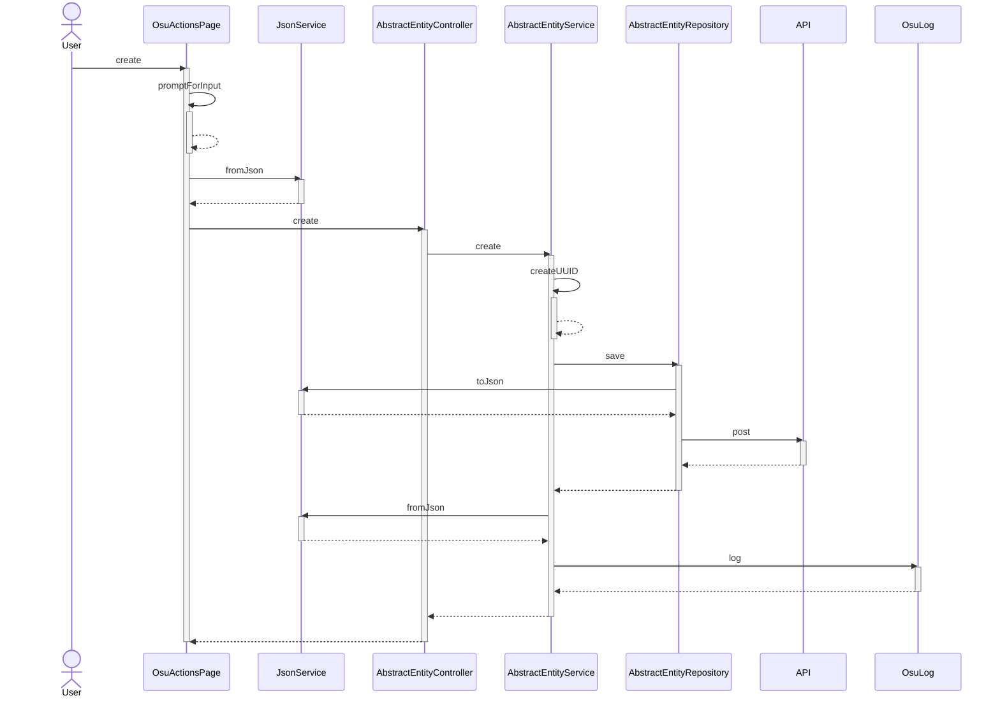

# M320
Joel Sow Mischa Strauss 

## Introduction
Welcome to the program where we create a GUI client using Java Swing and a backend built with abstract classes. 
Our backend, consisting of "AbstractEntity", "AbstractEntityService", "AbstractEntityController", and "AbstractEntityRepository", 
is integrated within the same project and communicates with a JSON server as the database. 
The program does not use Spring Boot and offers a unique approach to creating a "robust" and "efficient" backend.
_(!!Disclaimer: This is not a real-world application and is only used for educational purposes. Because of this, the backend is not using Spring...!!)_
Get ready to dive into the world of Java and develop a powerful and dynamic application.

I had alot of fun creating this program and I hope you enjoy it as well, though I do not recommend using this as a reference for your own projects.
As I had to go through alot of pain making everything generic, especially when mapping objects from json, to json etc.
(the hibernate layer is missing)

## Content
- CRUD operations for two entities (User and Osu)
- Java Swing GUI
- Abstract classes for backend for easy implementing of new entities
- JSON server as database
- Generic methods for mapping objects to json and vice versa


---
#### sequence diagram of creating a new osu object and saving it in the DB

---


## Setup
get json-server:
`npm install -g json-server`
start db:
`json-server --watch m320.db.json`
initialize the db:
```json
{
  "osu": [],
  "user": []
}
```

# Conclusion
- was it worth it?
  - yes:
    I learned alot about abstract classes and how to use them in a real-world application.
    I also learned alot about the java swing library and how to use it to create a GUI. 
    It took me most of the time to implement the first Entity, and the user entity took me 10 minutes to implement, because its all generic.
  - no:
    I had to go through alot of pain to make everything generic, especially when mapping objects from json, to json etc.
    (the hibernate layer is missing)
- would I do it again?
  - No. Although it was fun, I would not do it again. Though I would use the same approach (generic programming) for a real-world application.
- would I recommend it?
  - No. I would not recommend it. It was fun, but it was not worth it. I would recommend using Spring Boot instead.