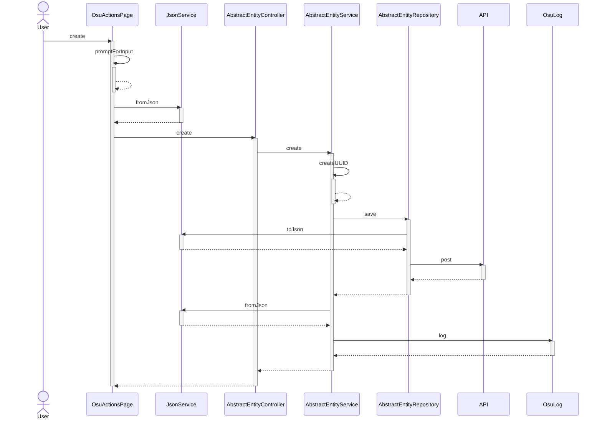

# M320
Joel Sow Mischa Strauss 

start db:
json-server --watch m320.db.json

```mermaid
sequenceDiagram
actor User
User ->> OsuActionsPage : create
activate OsuActionsPage
OsuActionsPage ->> OsuActionsPage : promptForInput
activate OsuActionsPage
OsuActionsPage -->> OsuActionsPage : #32; 
deactivate OsuActionsPage
OsuActionsPage ->> JsonService : fromJson
activate JsonService
JsonService -->> OsuActionsPage : #32; 
deactivate JsonService
OsuActionsPage ->> AbstractEntityController : create
activate AbstractEntityController
AbstractEntityController ->> AbstractEntityService : create
activate AbstractEntityService
AbstractEntityService ->> AbstractEntityService : createUUID
activate AbstractEntityService
AbstractEntityService -->> AbstractEntityService : #32; 
deactivate AbstractEntityService
AbstractEntityService ->> AbstractEntityRepository : save
activate AbstractEntityRepository
AbstractEntityRepository ->> JsonService : toJson
activate JsonService
JsonService -->> AbstractEntityRepository : #32; 
deactivate JsonService
AbstractEntityRepository ->> API : post
activate API
API -->> AbstractEntityRepository : #32; 
deactivate API
AbstractEntityRepository -->> AbstractEntityService : #32; 
deactivate AbstractEntityRepository
AbstractEntityService ->> JsonService : fromJson
activate JsonService
JsonService -->> AbstractEntityService : #32; 
deactivate JsonService
AbstractEntityService ->> OsuLog : log
activate OsuLog
OsuLog -->> AbstractEntityService : #32; 
deactivate OsuLog
AbstractEntityService -->> AbstractEntityController : #32; 
deactivate AbstractEntityService
AbstractEntityController -->> OsuActionsPage : #32; 
deactivate AbstractEntityController
deactivate OsuActionsPage

```
